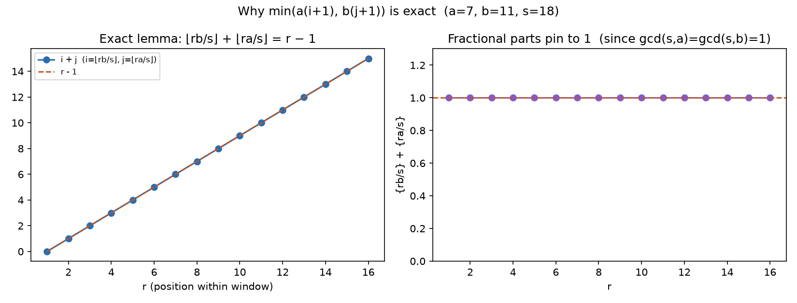

# Proof: the O(1) formula for the n-th coprime-exclusive multiple

## What this repo is

`termboost` benchmarks two ways of answering the same question — a
binary-search baseline (`Main.binaryApproach`) and a closed-form, O(1)
formula I derived (`Main.trUE_n_Smallest_AB`) — and this document plus
[`proof/proof.py`](proof/proof.py) is the proof that the formula is
actually correct, not just fast.

The full written derivation, with an interactive slider-driven visual proof,
lives on my site:
**[TermBoost: The n-th Coprime-Exclusive Multiple in O(1)](https://TODO-replace-with-your-live-site-domain/articles/termboost-nth-coprime-multiple.html)**
<!-- TODO: swap in the live URL once the site is deployed; the article
     source is research-site/articles/termboost-nth-coprime-multiple.html. -->
That page derives the formula step by step in prose. This document instead
proves it computationally: symbolically, numerically, and graphically, in
Python, independent of the Java implementation.

## Problem statement

Fix two coprime integers `a, b > 1` with `a < b`, and a positive integer `n`.
Find the `n`-th smallest positive integer divisible by `a` or by `b`, but
not both.

For `a=2, b=3`: `2, 3, 4, 8, 9, 10, 14, 15, 16, ...` — `6` and `12` are
skipped (multiples of both).

Everything below rests on one function, the count of qualifying integers
in `[1, x]`:

```
count(x) = floor(x/a) + floor(x/b) - 2 * floor(x/(ab))
```

(subtracting the "both" term *twice* — once to undo ordinary
inclusion–exclusion's single subtraction, once more to remove it from the
tally entirely, since we want "exactly one" divisor, not "at least one").

## Step 1 — count(x) is flat except at qualifying integers

**Claim:** `count(x) - count(x-1)` is `1` if `x` is divisible by exactly one
of `a, b`, and `0` otherwise.

This is what makes "smallest `x` with `count(x) >= n`" the *same* problem as
"the `n`-th qualifying integer," with no off-by-one patching needed — a
single floor-value increase always lands exactly on a hit.

`proof/proof.py::symbolic_flatness_argument` checks this directly: for a
handful of coprime `(a, b)` pairs, it walks `x` across three full periods
and confirms `count(x) - count(x-1)` matches the exactly-one-divisor
indicator at every single integer, not just on average.

```
$ python3 proof/proof.py
=== 1. Symbolic flatness argument ===
  a=2, b=3: step matches indicator over 3*ab range -> OK
  a=3, b=5: step matches indicator over 3*ab range -> OK
  a=4, b=7: step matches indicator over 3*ab range -> OK
  a=5, b=8: step matches indicator over 3*ab range -> OK
```


*`count(x)` for `a=2, b=3, n=12`: every step is height exactly 1, and the
step lands exactly where the dashed target line (`n`) meets the answer
(`x = 22`).*

## Step 2 — the sequence is periodic with period ab

If `x` qualifies (divisible by exactly one of `a, b`), so does `x + ab`:
adding a multiple of `ab` changes divisibility by neither `a` nor `b`. So
the whole problem reduces to solving it once inside a window `(0, ab]`,
then translating by however many full windows are skipped.

Inside `(0, ab)` there are `b-1` multiples of `a` and `a-1` multiples of
`b`, and — because `gcd(a,b)=1` — none of them coincide except at the
boundary `ab` itself. So **every one** of these `a+b-2` multiples
qualifies; that constant is exactly the number of qualifying terms per
period.


*`a=3, b=5`: multiples of `a` (blue, above the line) and multiples of `b`
(orange, below), repeating identically every `ab = 15` — always
`a+b-2 = 6` qualifying points per window, never touching at the shared
multiple of `ab`.*

Peeling off `k = floor(n / (a+b-2))` whole windows contributes `k*ab` to
the answer (the `filler` term in the code) and leaves a residual index
`r = n mod (a+b-2)` to be found inside the *next* window.

## Step 3 — solving inside one window without a search

What's left: find the `r`-th smallest element of the merged, sorted set
`{a, 2a, ...} ∪ {b, 2b, ...}`. The exact integer answer `v` satisfies
`floor(v/a) + floor(v/b) = r`. Dropping the floors and solving the
*continuous* relaxation `v/a + v/b = r` gives a closed form:

```
$ python3 proof/proof.py
=== 2. Continuous relaxation ===
  Solving v/a + v/b = r for v gives v0 = a*b*r/(a + b)
  => v0/a = b*r/(a + b),  v0/b = a*r/(a + b)
  These match rat_a = (n*b)/(a+b) and rat_b = (n*a)/(a+b) in trUE_n_Smallest_AB.
```

`proof.py::symbolic_continuous_relaxation` derives `v0 = r·ab/(a+b)`
symbolically with sympy rather than by hand, then confirms
`v0/a` and `v0/b` are literally the `rat_a`/`rat_b` expressions used in the
Java (and Python port) code.

Truncating `v0/a` and `v0/b` estimates how many multiples of `a` and of `b`
have been consumed by position `r`. Because `v0` solves the relaxed
equation *exactly*, the floor-truncation error stays bounded — small enough
that the true answer is always one of exactly two candidates: the next
unconsumed multiple of `a`, or the next unconsumed multiple of `b`. A single
comparison (`a*rat_a` vs `b*rat_b`) picks the right one.


*`a=7, b=11`: left, the continuous relaxation `v0` (line) tracks the true
integer answer (dots) closely across a full window; right, the gap between
them stays well under the `max(a, b)` bound `proof.py::plot_relaxation_margin`
checks numerically — which is exactly why only two candidates ever need
comparing.*

## Step 3½ — why "two candidates" is *exact*, not just close

Step 3 argues the relaxation error is bounded, so the answer is one of two
candidates. We can make that airtight — with **no error term at all** — which
also yields the cleanest form of the formula.

Write `s = a + b`, and inside a window let

```
i = floor(r*b/s)   (≈ multiples of a consumed by position r)
j = floor(r*a/s)   (≈ multiples of b consumed by position r)
```

**Lemma.** For every residual `r` with `1 ≤ r ≤ s-2`,

```
floor(r*b/s) + floor(r*a/s) = r - 1.
```

*Proof.* The two exact fractions sum to an integer:
`r*b/s + r*a/s = r*(a+b)/s = r`. Writing each as `⌊·⌋ + {·}` (integer plus
fractional part), `i + j = r - ({r*b/s} + {r*a/s})`. The two fractional parts
sum to an integer, hence to `0` or `1`; they sum to `0` only if `s | r*b` and
`s | r*a`. But `gcd(a,b)=1` gives `gcd(s,a) = gcd(a+b,a) = gcd(b,a) = 1` and
likewise `gcd(s,b)=1`, so `s | r*b ⇔ s | r`, impossible for `1 ≤ r ≤ s-2`.
Thus both fractional parts are nonzero, their sum is `1`, and `i + j = r-1`. ∎



*`a=7, b=11`: left, `i + j` sits exactly on `r − 1` for every `r`; right, the
fractional-part twin `{rb/s} + {ra/s}` is pinned to `1` — the coprimality fact
that forces the lemma. Generated by `proof.py::plot_exact_lemma`.*

So after `i` multiples of `a` and `j` multiples of `b`, **exactly** `r-1`
qualifying terms have passed. The `r`-th is therefore the smaller of the *next*
multiple of each:

```
W_r = min( a*(i+1), b*(j+1) ).
```

Two short strict inequalities (again from `s ∤ r`) confirm the count lands
right: `a*i < b*(j+1)` and `b*j < a*(i+1)`, so at `min(a(i+1), b(j+1))` the
counting function equals exactly `r`. Adding back the stripped periods
`q = ⌊(n-1)/p⌋` (with `p = s-2`) gives the whole answer:

```
answer = q*a*b + min( a*(i+1), b*(j+1) ).
```

This is the same value `trUE_n_Smallest_AB` computes — `proof.py`'s
`exact_lemma_check` confirms the lemma has **zero** violations across all 1855
coprime pairs below 80, and that this clean form agrees with both brute force
and the Java port on every case:

```
$ python3 proof/proof.py
=== 2b. Exact lemma: floor(rb/s)+floor(ra/s) = r-1 ===
  Coprime pairs checked: 1855
  Lemma violations (floor(rb/s)+floor(ra/s) != r-1): 0
  clean form vs brute force mismatches:               0
  clean form vs Java-port true_n_smallest_ab:         0
```

## Step 4 — exhaustive numeric verification

Steps 1–3 explain *why* the formula works. As a final, independent check
(deliberately re-implemented in Python rather than shared with the Java, so
the two can't hide a common bug), `proof.py::numeric_cross_check`
brute-force-verifies `true_n_smallest_ab` against a direct enumeration
across hundreds of random coprime pairs and a spread of `n`:

```
$ python3 proof/proof.py
=== 3. Numeric cross-check (independent Python re-implementation) ===
  Checked 4500 (a, b, n) triples across 300 coprime pairs.
  All matched. No counterexample found.
```

The same check is run at much larger scale by three independent
implementations, so no shared bug can hide:

- **Java** (`Main.benchmark`): 1,000,000 generated coprime pairs, zero
  mismatches between `binaryApproach` and `trUE_n_Smallest_AB`.
- **C++** (`cpp/benchmark.cpp`): a self-test over `a,b ≤ 30`, then
  `binarySearch == formula` verified on every case in the test file.
- **Python** (`tests/test_correctness.py`, run with `pytest`): the exhaustive
  small grid vs. brute force, all period boundaries `n = kp-1, kp, kp+1`, a
  validity/rank check (`x ∈ V`, `C(x)=n`, `C(x-1)=n-1`), and 50,000 large
  random cases (`a,b ≤ 10⁵`, `n ≤ 10⁷`) vs. binary search.

All report zero mismatches. See the [benchmark section of the
README](README.md#benchmark) for timings.

## Reproducing this document

```sh
python3 -m venv .venv && source .venv/bin/activate
pip install -r requirements.txt
python3 proof/proof.py          # symbolic + exact-lemma + numeric checks, figures
pytest -q                        # the correctness suite (PYTHONPATH=src)
```

`proof.py` regenerates all four figures in `proof/figures/`
(`periodic_blocks`, `count_staircase`, `exact_lemma`, `relaxation_margin`) and
reprints every transcript block quoted above.
